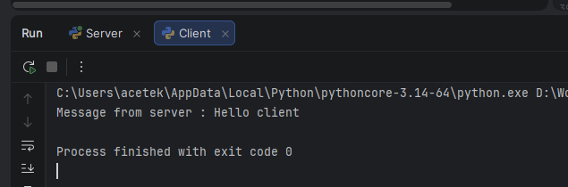
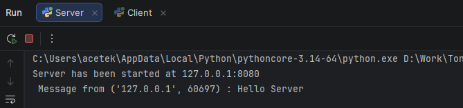
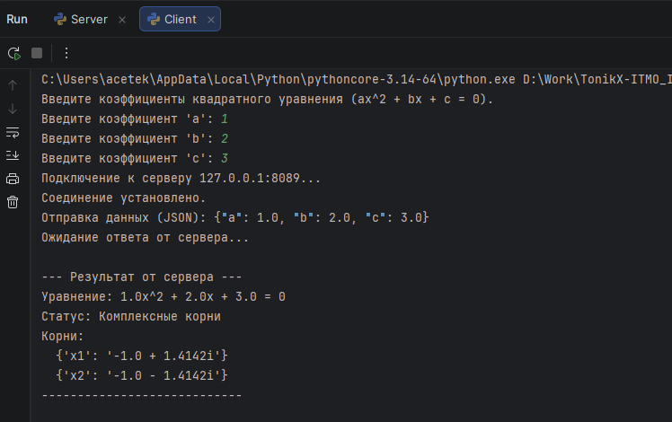
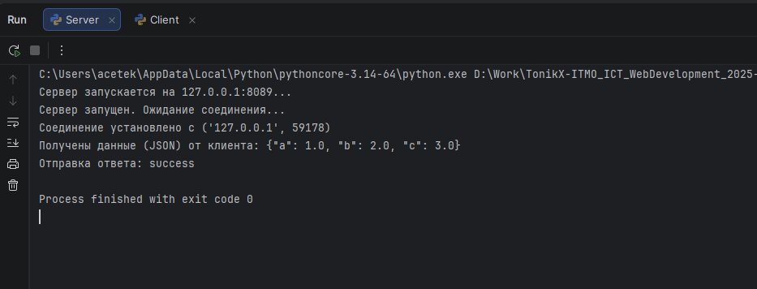
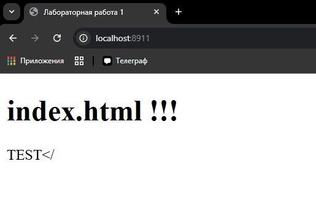
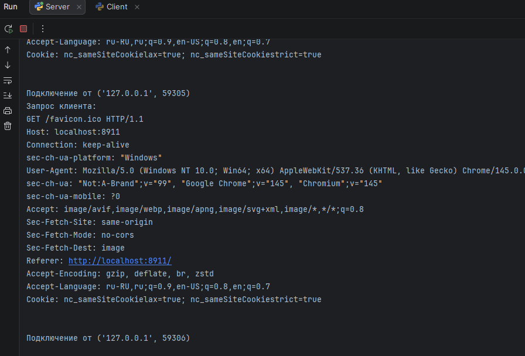
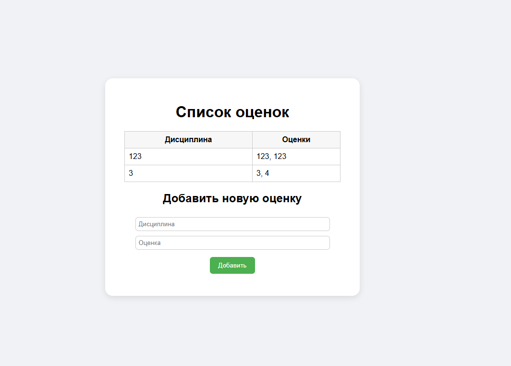

# Лабораторная работа №1

**Студент:** Шукалов Андрей Денисович  
**Университет:** ИТМО  
**Группа:** К3339 

---

## Содержание

1. [Задание 1 (UDP)](#задание-1-udp)
2. [Задание 2 (TCP)](#задание-2-tcp)
3. [Задание 3 (HTTP)](#задание-3-http)
4. [Задание 4 (Многопользовательский чат)](#задание-4-многопользовательский-чат)
5. [Задание 5 (Web-сервер)](#задание-5-web-сервер)

---

## Задание 1 (UDP)<a id="задание-1-udp"></a>

### Условие
Реализовать клиентскую и серверную часть приложения. Клиент отправляет серверу сообщение «Hello, server», и оно должно отобразиться на стороне сервера. В ответ сервер отправляет клиенту сообщение «Hello, client», которое должно отобразиться у клиента.

### Требования
- Использовать библиотеку `socket`.
- Реализовать обмен с помощью протокола UDP.

### Код:

Server.py:
```python
import socket

# Server settings
host = "127.0.0.1"
port = 8080

# Message
message = "Hello client"

ServerSocket = socket.socket(socket.AF_INET, socket.SOCK_DGRAM)
ServerSocket.bind((host, port))

print(f"Server has been started at {host}:{port}")

while True:
    data, address = ServerSocket.recvfrom(1024)
    print(f" Message from {address} : {data.decode()}")
    ServerSocket.sendto(message.encode(), address)

```

Client.py:
```python
import socket
import time

# Server settings
serverHost = "127.0.0.1"
serverPort = 8080

# Message
message = "Hello Server"

ClientSocket = socket.socket(socket.AF_INET, socket.SOCK_DGRAM)

# Send msg
ClientSocket.sendto(message.encode(), (serverHost, serverPort))

# Receive msg
data, _ = ClientSocket.recvfrom(1024)

print(f"Message from server : {data.decode()}")

time.sleep(120)
```

### Суть работы 
- Разработан UDP-клиент и сервер, которые обмениваются сообщениями. Клиент отправляет сообщение серверу, сервер его принимает и отвечает обратно. Основная цель - показать работу протокола UDP и обмен данными без установления соединения.

### Клиент


### Сервер



## Задание 2 (TCP) <a id="задание-2-tcp"></a>

### Условие
Реализовать клиентскую и серверную часть приложения. Клиент запрашивает выполнение математической операции, параметры которой вводятся с клавиатуры. Сервер обрабатывает данные и возвращает результат клиенту.  
Вариан - решение квадратного уравнения с заданными параметрами.
### Требования
- Использовать библиотеку `socket`.
- Реализовать обмен с помощью протокола TCP.

### Код:

server.py:
```python
import json
import math
import socket

# Параметры сервера
HOST = '127.0.0.1'
PORT = 8089

def solve_quadratic(a, b, c):
    result = {"equation": f"{a}x^2 + {b}x + {c} = 0", "status": "success", "roots": []}
    if a == 0:
        if b == 0:
            result["status"] = "error"
            result["message"] = "Не квадратное уравнение: a и b равны 0."
        else:
            x = -c / b
            result["message"] = "Линейное уравнение"
            result["roots"] = [{"x": round(x, 4)}]
        return result
    discriminant = b ** 2 - 4 * a * c
    if discriminant < 0:
        real_part = -b / (2 * a)
        imaginary_part = math.sqrt(abs(discriminant)) / (2 * a)
        result["message"] = "Комплексные корни"
        result["roots"] = [
            {"x1": f"{round(real_part, 4)} + {round(imaginary_part, 4)}i"},
            {"x2": f"{round(real_part, 4)} - {round(imaginary_part, 4)}i"}
        ]
    elif discriminant == 0:
        x = -b / (2 * a)
        result["message"] = "Один действительный корень"
        result["roots"] = [{"x": round(x, 4)}]
    else:
        x1 = (-b + math.sqrt(discriminant)) / (2 * a)
        x2 = (-b - math.sqrt(discriminant)) / (2 * a)
        result["message"] = "Два действительных корня"
        result["roots"] = [{"x1": round(x1, 4)}, {"x2": round(x2, 4)}]
    return result

def start_server():
    print(f"Сервер запускается на {HOST}:{PORT}...")
    with socket.socket(socket.AF_INET, socket.SOCK_STREAM) as s:
        s.bind((HOST, PORT))
        s.listen()
        print("Сервер запущен. Ожидание соединения...")
        connection, address = s.accept()
        with connection:
            print(f"Соединение установлено с {address}")
            data = connection.recv(1024)
            if not data:
                return
            received_json_str = data.decode('utf-8')
            print(f"Получены данные (JSON) от клиента: {received_json_str}")
            response_data = {}
            try:
                coeffs = json.loads(received_json_str)
                a = coeffs['a']
                b = coeffs['b']
                c = coeffs['c']
                response_data = solve_quadratic(a, b, c)
            except json.JSONDecodeError:
                response_data = {"status": "error", "message": "Ошибка декодирования JSON. Неверный формат."}
            except KeyError:
                response_data = {"status": "error", "message": "Ошибка: Отсутствует один из ключей (a, b, c)."}
            except Exception as e:
                response_data = {"status": "error", "message": f"Неизвестная ошибка на сервере: {e}"}
            response_json_str = json.dumps(response_data)
            print(f"Отправка ответа: {response_data['status']}")
            connection.sendall(response_json_str.encode('utf-8'))

if __name__ == '__main__':
    start_server()

```

client.py:
```python
import json
import socket

HOST = '127.0.0.1'
PORT = 8089

def start_client():
    print("Введите коэффициенты квадратного уравнения (ax^2 + bx + c = 0).")
    try:
        a = float(input("Введите коэффициент 'a': "))
        b = float(input("Введите коэффициент 'b': "))
        c = float(input("Введите коэффициент 'c': "))
    except ValueError:
        print("Ошибка ввода: Введите числовые значения.")
        return
    data_dict = {
        "a": a,
        "b": b,
        "c": c
    }
    data_to_send = json.dumps(data_dict)
    with socket.socket(socket.AF_INET, socket.SOCK_STREAM) as s:
        try:
            print(f"Подключение к серверу {HOST}:{PORT}...")
            s.connect((HOST, PORT))
            print("Соединение установлено.")
            print(f"Отправка данных (JSON): {data_to_send}")
            s.sendall(data_to_send.encode('utf-8'))
            print("Ожидание ответа от сервера...")
            data = s.recv(1024)
            received_json_str = data.decode('utf-8')
            result = json.loads(received_json_str)
            print("\n--- Результат от сервера ---")
            if result.get("status") == "success":
                print(f"Уравнение: {result['equation']}")
                print(f"Статус: {result['message']}")
                print("Корни:")
                for root in result['roots']:
                    print(f"  {root}")
            else:
                print(f"Ошибка: {result.get('message', 'Неизвестная ошибка')}")
            print("----------------------------\n")
        except ConnectionRefusedError:
            print(f"Ошибка: Не удалось подключиться к серверу {HOST}:{PORT}. Убедитесь, что сервер запущен.")
        except json.JSONDecodeError:
            print("Ошибка: Получен неверный JSON-ответ от сервера.")
        except Exception as e:
            print(f"Произошла ошибка: {e}")

if __name__ == '__main__':
    start_client()
```

### Суть работы 
- Разработан TCP-клиент и сервер для нахождения корней уравнения. Клиент отправляет серверу три числа (коэффициенты a, b, c), сервер вычисляет корни и возвращает результат.

### Клиент


### Сервер


---

## Задание 3 (HTTP) <a id="задание-3-http"></a>

### Условие
Реализовать серверную часть приложения. Клиент подключается к серверу, и в ответ получает HTTP-сообщение, содержащее HTML-страницу, которая сервер подгружает из файла index.html.

### Требования
- Использовать библиотеку `socket`.

### Код:

index.html:
```html
<!doctype html>
<html lang="ru">
<head>
  <meta charset="utf-8" />
  <title>Лабораторная работа 1</title>
</head>
<body>
  <h1>index.html !!!</h1>
  <p>TEST</p>
</body>
</html>
```

Server.py:
```python
import socket

server_socket = socket.socket(socket.AF_INET, socket.SOCK_STREAM)
server_socket.bind(('localhost', 8911))
server_socket.listen(1)
print("Сервер запущен на порту 8911...")

with open('index.html', 'r', encoding='utf-8') as file:
    html_content = file.read()
while True:
    client_connection, client_address = server_socket.accept()
    print(f'Подключение от {client_address}')
    request = client_connection.recv(1024).decode()
    print(f'Запрос клиента:\n{request}')
    http_response = (
        "HTTP/1.1 200 OK\r\n"
        "Content-Type: text/html; charset=UTF-8\r\n"
        f"Content-Length: {len(html_content)}\r\n"
        "Connection: close\r\n"
        "\r\n"
        + html_content
    )
    client_connection.sendall(http_response.encode())
    client_connection.close()
```

### Суть работы
Разработан HTTP-сервер на Python с использованием сокетов. Сервер принимает запросы от клиента, загружает HTML-файл index.html и возвращает его браузеру в виде HTTP-ответа.

### Скриншоты работы


---

## Задание 4 (Многопользовательский чат) <a id="задание-4-многопользовательский-чат"></a>

### Условие
Реализовать двухпользовательский или многопользовательский чат. Клиенты подключаются к серверу и обмениваются сообщениями через сервер.

### Требования
- Обязательно использовать библиотеку `socket`.
- Для многопользовательского чата использовать библиотеку `threading`.
- Протокол TCP — 100% баллов; UDP — 80% (для UDP использовать потоки для приёма сообщений).

### Код:

Server.py:
```python
import socket
import threading


class ChatServer:
    def __init__(self, host='localhost', port=8911):
        self.host = host
        self.port = port
        self.socket = None
        self.clients = {}
        self.lock = threading.Lock()
        self.guest_counter = 0
        self.is_running = False
        self.admin_thread = None

    def start(self):
        self.socket = socket.socket(socket.AF_INET, socket.SOCK_STREAM)
        self.socket.setsockopt(socket.SOL_SOCKET, socket.SO_REUSEADDR, 1)
        self.socket.bind((self.host, self.port))
        self.socket.listen(5)
        self.is_running = True

        self.admin_thread = threading.Thread(target=self.admin_loop, daemon=True)
        self.admin_thread.start()

        print(f"Server started on: {self.host}:{self.port}")
        print("Commands:")
        print("/stop --- stop the server")

        try:
            while self.is_running:
                try:
                    self.socket.settimeout(1.0)
                    client_socket, addr = self.socket.accept()

                    if not self.is_running:
                        client_socket.close()
                        break

                    print(f"Новое подключение: {addr}")
                    guest_name = f"Гость {self.guest_counter}"
                    self.guest_counter += 1

                    with self.lock:
                        self.clients[client_socket] = guest_name

                    client_thread = threading.Thread(
                        target=self.handle_client,
                        args=(client_socket, guest_name)
                    )
                    client_thread.daemon = True
                    client_thread.start()
                except socket.timeout:
                    continue
                except OSError as e:
                    if self.is_running:
                        print(f"Socket error: {e}")
                    break
        except KeyboardInterrupt:
            print("Stopping...")
            self.stop()
        finally:
            if self.is_running:
                self.stop()

    def handle_client(self, client_socket, username):
        self.broadcast(f"{username} connected!", exclude=client_socket)
        client_socket.send(f"Hello, {username}!".encode())

        while self.is_running:
            try:
                client_socket.settimeout(1.0)
                message = client_socket.recv(1024).decode()
                if not message:
                    break
                if self.is_running:
                    self.broadcast(f"{username}: {message}", exclude=client_socket)
            except socket.timeout:
                continue
            except:
                break

        self.remove_client(client_socket, username)

    def broadcast(self, message, exclude=None):
        with self.lock:
            disconnected = []
            for client, username in self.clients.items():
                if client != exclude:
                    try:
                        client.send(message.encode())
                    except:
                        disconnected.append(client)

            for client in disconnected:
                if client in self.clients:
                    del self.clients[client]

    def remove_client(self, client_socket, username):
        with self.lock:
            if client_socket in self.clients:
                del self.clients[client_socket]
        if self.is_running:
            self.broadcast(f"{username} disconnected!")

        client_socket.close()
        print(f"{username} disconnected!")

    def admin_loop(self):
        while self.is_running:
            command = input()
            if command == '/stop':
                print("Stopping...")
                self.stop()
                break

    def stop(self):
        self.is_running = False
        with self.lock:
            for client in list(self.clients.keys()):
                client.close()
            self.clients.clear()
        if self.socket:
            self.socket.close()
            self.socket = None
        print("Server stopped")


if __name__ == "__main__":
    server = ChatServer()
    server.start()
```

client.py:
```python
import socket
import threading

class ChatClient:
    def __init__(self, host='localhost', port=8911):
        self.host = host
        self.port = port
        self.socket = socket.socket(socket.AF_INET, socket.SOCK_STREAM)
        self.running = False
    def start(self):
        try:
            self.socket.connect((self.host, self.port))
            self.running = True
            receive_thread = threading.Thread(target=self.receive_messages)
            receive_thread.daemon = True
            receive_thread.start()
            print("Connected. To end send: /exit")
            while self.running:
                message = input()
                if message == '/exit':
                    break
                self.socket.send(message.encode())
        except Exception as e:
            print(f"Connection error: {e}")
        finally:
            self.stop()

    def receive_messages(self):
        while self.running:
            try:
                message = self.socket.recv(1024).decode()
                if not message:
                    break
                print(message)
            except:
                break

    def stop(self):
        self.running = False
        self.socket.close()
        print("Disconnected")

if __name__ == "__main__":
    client = ChatClient()
    client.start()
```

### Суть работы
Разработан многопользовательский чат на TCP с использованием потоков (threading). Сервер обрабатывает подключения нескольких клиентов одновременно, пересылая сообщения всем остальным пользователям. Клиент может одновременно получать и отправлять сообщения. 


## Задание 5 (Web-сервер) <a id="задание-5-web-сервер"></a>

### Условие
Написать простой веб‑сервер на Python с использованием `socket`, который:
- принимает и записывает информацию о дисциплине и оценке (POST),
- возвращает HTML‑страницу со всеми оценками (GET).

### Требования
- Использовать библиотеку `socket`.

### Код:

Server.py:
```python
import socket
import urllib.parse
from collections import defaultdict

HOST = "127.0.0.1"
PORT = 8911
grades = []

def group_grades():
    grouped = defaultdict(list)
    for discipline, grade in grades:
        grouped[discipline].append(grade)
    return grouped


def generate_table_rows():
    grouped = group_grades()
    if not grouped:
        return "<tr><td colspan='2'>Нет данных</td></tr>"
    rows = ""
    for discipline, marks in grouped.items():
        marks_str = ", ".join(marks)
        rows += f"<tr><td>{discipline}</td><td>{marks_str}</td></tr>"
    return rows


def build_html():
    rows = generate_table_rows()
    return f"""
    <html>
    <head>
        <meta charset="utf-8">
        <title>Оценки по дисциплинам</title>
        <style>
            body {{
                font-family: Arial, sans-serif;
                background-color: #f0f2f5;
                height: 100vh;
                margin: 0;
                display: flex;
                justify-content: center;
                align-items: center;
            }}
            .container {{
                background: white;
                border-radius: 16px;
                padding: 30px 40px;
                box-shadow: 0 4px 12px rgba(0,0,0,0.1);
                width: 450px;
                text-align: center;
            }}
            table {{
                width: 100%;
                border-collapse: collapse;
                margin-bottom: 20px;
            }}
            th, td {{
                border: 1px solid #ccc;
                padding: 8px;
            }}
            th {{
                background: #f7f7f7;
            }}
            input[type="text"] {{
                width: 90%;
                padding: 6px;
                margin: 5px 0;
                border: 1px solid #ccc;
                border-radius: 6px;
            }}
            input[type="submit"] {{
                background: #4CAF50;
                color: white;
                border: none;
                padding: 10px 18px;
                border-radius: 6px;
                cursor: pointer;
                margin-top: 10px;
            }}
            input[type="submit"]:hover {{
                background: #45a049;
            }}
        </style>
    </head>
    <body>
        <div class="container">
            <h1>Список оценок</h1>
            <table>
                <tr>
                    <th>Дисциплина</th>
                    <th>Оценки</th>
                </tr>
                {rows}
            </table>
            <h2>Добавить новую оценку</h2>
            <form method="POST" action="/">
                <input type="text" name="discipline" placeholder="Дисциплина" required><br>
                <input type="text" name="grade" placeholder="Оценка" required><br>
                <input type="submit" value="Добавить">
            </form>
        </div>
    </body>
    </html>
    """


def read_http_request(conn):
    data = b""
    while b"\r\n\r\n" not in data:
        part = conn.recv(1024)
        if not part:
            break
        data += part
    headers_part, _, body = data.partition(b"\r\n\r\n")
    headers_text = headers_part.decode("utf-8", errors="ignore")
    content_length = get_content_length(headers_text)
    while len(body) < content_length:
        part = conn.recv(1024)
        if not part:
            break
        body += part
    return (headers_part + b"\r\n\r\n" + body).decode("utf-8", errors="ignore")


def get_content_length(headers):
    for line in headers.split("\r\n"):
        if line.lower().startswith("content-length"):
            try:
                return int(line.split(":")[1].strip())
            except ValueError:
                return 0
    return 0


def parse_request_line(headers):
    first_line = headers.split("\r\n")[0]
    try:
        method, path, version = first_line.split()
        return method, path, version
    except ValueError:
        return None, None, None


def handle_post(body):
    decoded = urllib.parse.unquote_plus(body)
    params = urllib.parse.parse_qs(decoded)
    discipline = params.get("discipline", [""])[0]
    grade = params.get("grade", [""])[0]
    if discipline and grade:
        grades.append((discipline, grade))
    return "HTTP/1.1 303 See Other\r\nLocation: /\r\n\r\n"


def handle_get():
    html = build_html()
    return (
        "HTTP/1.1 200 OK\r\n"
        "Content-Type: text/html; charset=utf-8\r\n"
        "\r\n"
        + html
    )

def handle_request(request):
    headers, _, body = request.partition("\r\n\r\n")
    if not headers:
        return "HTTP/1.1 400 Bad Request\r\n\r\n"
    method, path, _ = parse_request_line(headers)
    if method == "POST":
        return handle_post(body)
    return handle_get()


def run_server():
    with socket.socket(socket.AF_INET, socket.SOCK_STREAM) as server:
        server.setsockopt(socket.SOL_SOCKET, socket.SO_REUSEADDR, 1)
        server.bind((HOST, PORT))
        server.listen(5)
        print(f"Server started: http://{HOST}:{PORT}/")
        while True:
            conn, addr = server.accept()
            with conn:
                request = read_http_request(conn)
                if not request:
                    continue
                response = handle_request(request)
                conn.sendall(response.encode("utf-8"))

if __name__ == "__main__":
    run_server()
```

### Суть работы
Разработан простой веб-сервер на Python с обработкой GET и POST запросов. Сервер принимает данные о дисциплине и оценке, сохраняет их и возвращает HTML-страницу со списком всех оценок.

### Скриншоты работы

---

## Вывод <a id="вывод"></a>
В ходе лабораторной работы №1 были изучены и реализованы различные сетевые приложения на Python с использованием библиотеки socket: обмен сообщениями по UDP, клиент-серверные вычисления по TCP, работа HTTP-сервера с HTML-страницами, многопользовательский чат и веб-сервер с обработкой GET и POST-запросов. Работа позволила закрепить практические навыки работы с протоколами UDP, TCP, потоками, HTTP и передачей данных между клиентом и сервером.