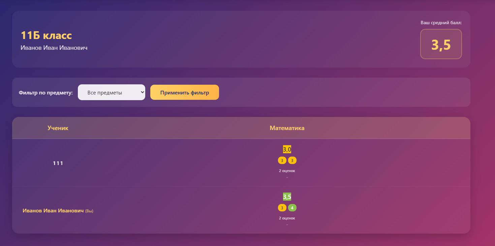
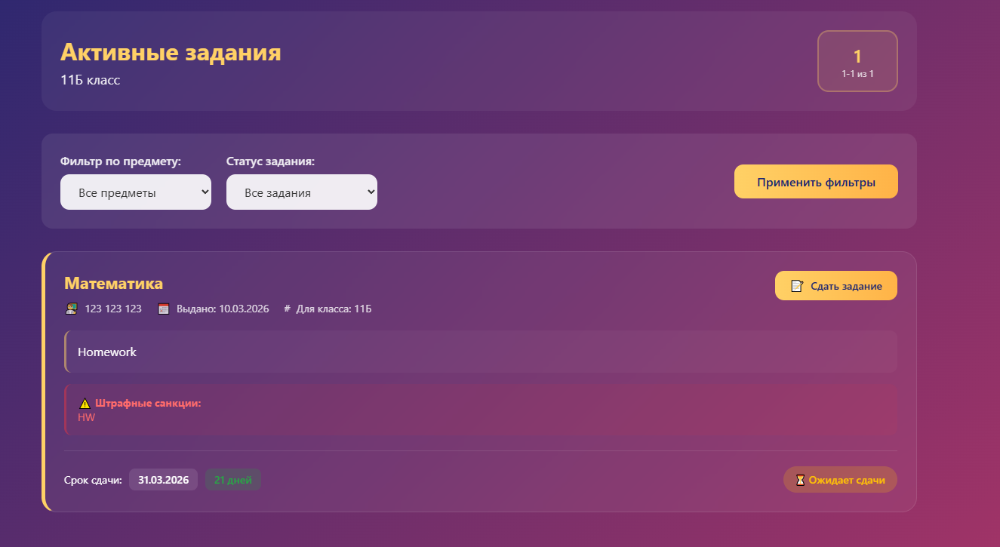
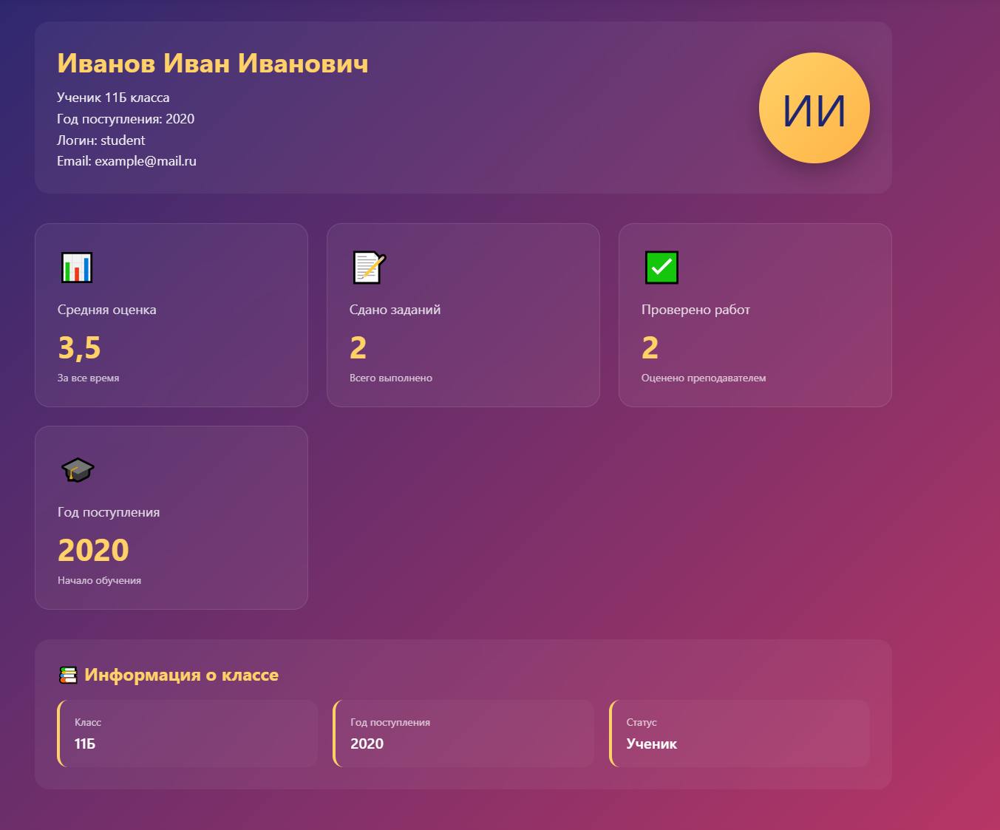
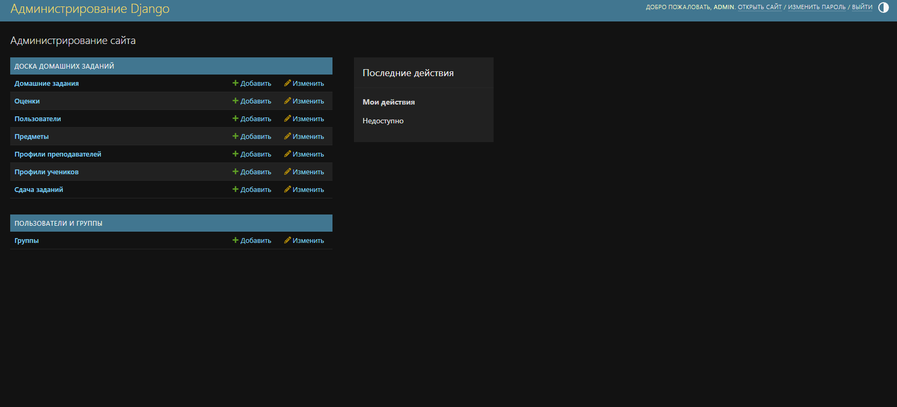

# Лабораторная работа №2

**Студент:** Шукалов Андрей Денисович  
**Университет:** ИТМО  
**Группа:** К3339
**Вариант 2:** Доска домашних заданий

О домашнем задании должна храниться следующая информация: предмет, преподаватель, дата выдачи, период выполнения, текст задания, информация о штрафах.

Необходимо реализовать следующий функционал:
- Регистрация новых пользователей.
- Просмотр домашних заданий по всем дисциплинам (сроки выполнения,
описание задания).
- Сдача домашних заданий в текстовом виде.
- Администратор (учитель) должен иметь возможность поставить оценку за
задание средствами Django-admin.
- В клиентской части должна формироваться таблица, отображающая оценки
всех учеников класса.

## Выполнение работы:
На странице регистрации нужно ввести никнейм, почту, ФИО и выбрать, в зависимости от выбора ввести дополнительные данные

На странице авторизации нужно ввести никнейм и пароль, можно перейти на окно регистриции или в админ панель

После авторизации ученика идет редирект на страницу с журналом

На странице с активными заданиями показываются все задания, есть сортировка по статусу сдачи и предмету

В профиле отображается информация об ученике, указанная при регистрации

И панель администратора, где можно управлять всем журналом, в т.ч. и добавлением оценок за задания.
